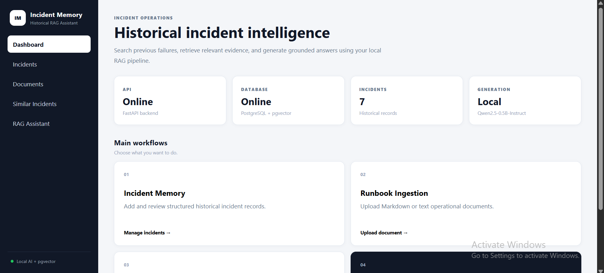
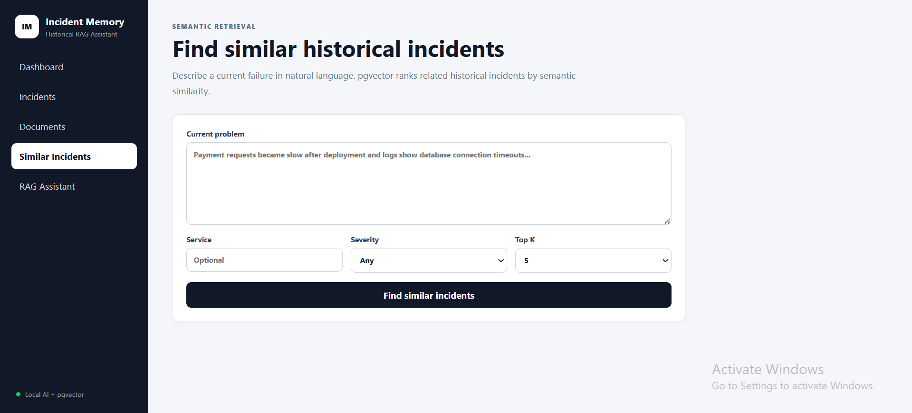
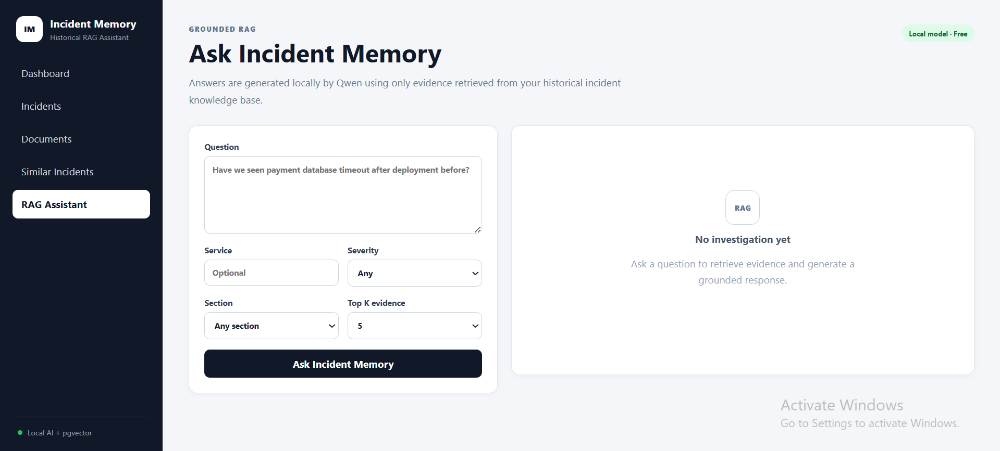
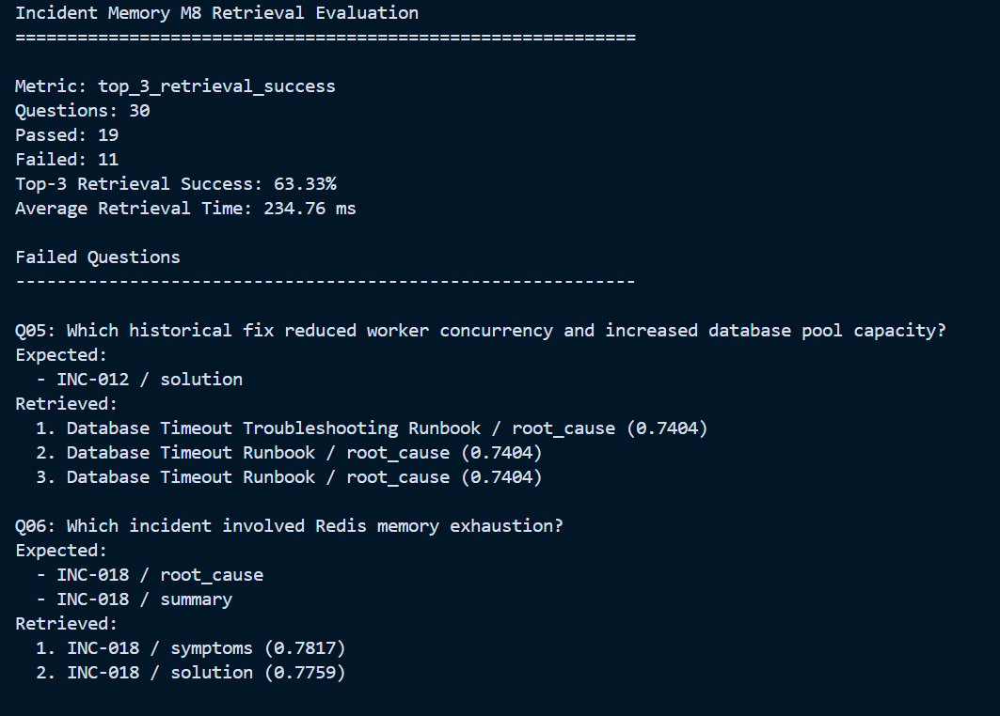
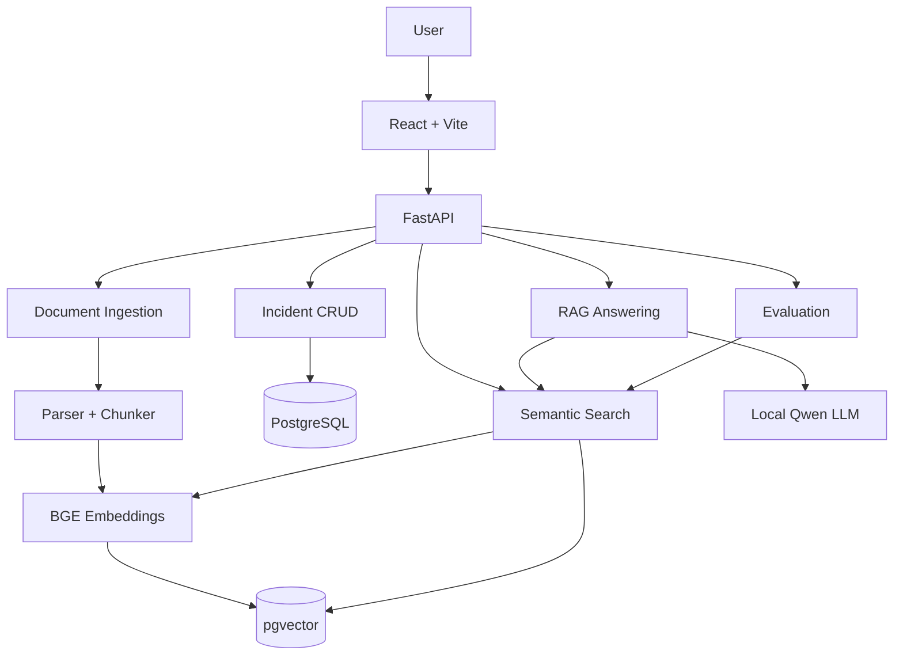
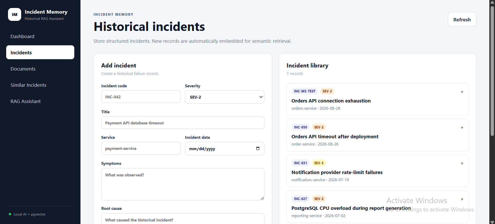

# Incident Memory

**RAG-Based Historical Incident Assistant**

Incident Memory is a full-stack Retrieval-Augmented Generation (RAG) application that helps software engineers search historical production incidents and operational runbooks, discover similar failures, review previous root causes and solutions, and receive evidence-grounded answers with source citations.

The project is designed as an understandable end-to-end RAG system rather than a large agent framework. Retrieval, vector storage, context construction, generation, citations, evaluation, frontend, and deployment are implemented explicitly.

---

## Demo



---

## Why Incident Memory?

Production incidents often repeat in different forms.

Important information may already exist in:

- incident reports
- postmortems
- troubleshooting notes
- operational runbooks

But engineers may not remember:

- which incident was similar
- what the earlier root cause was
- how it was resolved
- which runbook section is relevant

Incident Memory turns this historical operational knowledge into a searchable RAG knowledge base.

---

## Main Features

### Incident Management

Create, list, inspect, update, and delete structured historical incidents.

Incident fields include:

- incident code
- title
- service
- severity
- incident date
- symptoms
- root cause
- solution
- notes

Structured incidents are automatically converted into searchable evidence sections.

---

### Document Ingestion

Upload operational documents in:

- Markdown (`.md`)
- plain text (`.txt`)

Documents are:

1. validated
2. parsed into sections
3. split into chunks
4. embedded
5. stored in pgvector

---

### Semantic Search

Natural-language queries are embedded using:

`BAAI/bge-small-en-v1.5`

The system retrieves semantically similar chunks using pgvector cosine distance.

Supported metadata filters include:

- service
- severity
- section
- incident date

---

### Similar Incident Search

Describe a current software failure in natural language.

Incident Memory retrieves and ranks related historical incidents with:

- similarity score
- symptoms
- historical root cause
- historical solution
- matching evidence



---

### Local RAG Assistant

Incident Memory uses a local Hugging Face model:

`Qwen/Qwen2.5-0.5B-Instruct`

The language model receives only retrieved evidence.

The generated answer includes source labels such as:

```text
[S1]
[S2]
```

The API also returns structured source metadata for verification.



---

### Insufficient-Evidence Protection

If the retrieved evidence is too weak, Incident Memory does not ask the language model to invent an answer.

Instead it returns:

```text
There is not enough historical evidence to answer this question reliably.
```

---

### Evaluation

The project contains a Golden Test Set and a repeatable retrieval benchmark.

Primary metric:

**Top-3 Retrieval Success**

Evaluation outputs include:

- total benchmark questions
- passed questions
- failed questions
- retrieval success percentage
- average retrieval latency
- per-question Top-3 results

Reports are saved as JSON and CSV.

See:

[`docs/EVALUATION.md`](docs/EVALUATION.md)



---

## Architecture



Detailed architecture:

[`docs/ARCHITECTURE.md`](docs/ARCHITECTURE.md)

---

## RAG Pipeline

```text
Question
   ↓
BAAI/bge-small-en-v1.5
   ↓
384-dimensional query embedding
   ↓
PostgreSQL + pgvector
   ↓
Top-K evidence retrieval
   ↓
Similarity threshold
   │
   ├── weak evidence
   │       ↓
   │   Insufficient evidence
   │
   └── strong evidence
           ↓
      Evidence context
           ↓
   Qwen2.5-0.5B-Instruct
           ↓
      Grounded answer
           ↓
       [S1] [S2]
           ↓
    Structured sources
```

---

## Technology Stack

### Frontend

- React
- Vite
- JavaScript
- CSS

### Backend

- Python
- FastAPI
- Pydantic
- SQLAlchemy
- Alembic

### Database

- PostgreSQL
- pgvector

### AI / RAG

- Sentence Transformers
- `BAAI/bge-small-en-v1.5`
- `Qwen/Qwen2.5-0.5B-Instruct`
- cosine similarity
- section-aware chunking
- grounded prompting

### Infrastructure

- Docker
- Docker Compose
- Git
- GitHub

### Testing

- pytest
- FastAPI TestClient
- Golden retrieval benchmark

---

## Why Local Models?

The project intentionally uses free local Hugging Face models.

### Embeddings

```text
BAAI/bge-small-en-v1.5
```

Embedding dimension:

```text
384
```

### Generation

```text
Qwen/Qwen2.5-0.5B-Instruct
```

This means the application does not require a paid OpenAI, Gemini, Claude, or other hosted LLM API.

The first model download requires internet access. After downloading, Docker's Hugging Face cache can reuse the models.

---

## Project Structure

```text
Incident-Memory/
│
├── backend/
│   ├── alembic/
│   ├── app/
│   │   ├── api/
│   │   ├── core/
│   │   ├── db/
│   │   ├── schemas/
│   │   ├── scripts/
│   │   └── services/
│   │
│   ├── tests/
│   ├── Dockerfile
│   └── requirements.txt
│
├── frontend/
│   ├── src/
│   │   ├── pages/
│   │   ├── App.jsx
│   │   ├── api.js
│   │   ├── main.jsx
│   │   └── styles.css
│   │
│   ├── Dockerfile
│   ├── package.json
│   └── vite.config.js
│
├── data/
│   ├── evaluation/
│   │   ├── golden_questions.json
│   │   ├── manual_generation_checks.md
│   │   └── results/
│   │
│   ├── runbooks/
│   └── sample_incidents/
│
├── docs/
│   ├── screenshots/
│   ├── ARCHITECTURE.md
│   ├── DEMO.md
│   └── EVALUATION.md
│
├── .env.example
├── .gitignore
├── docker-compose.yml
└── README.md
```

---

## Requirements

Install:

- Docker Desktop
- Docker Compose
- Git

You do not need to manually install PostgreSQL, Node.js, Python packages, pgvector, or the AI models on the host machine when running through Docker.

---

## Quick Start

### 1. Clone

```bash
git clone https://github.com/RamijWasithRahat/Incident-Memory.git
cd Incident-Memory
```

### 2. Create environment file

Windows PowerShell:

```powershell
Copy-Item .env.example .env
```

Linux/macOS:

```bash
cp .env.example .env
```

The default configuration uses local Hugging Face models and does not require an LLM API key.

### 3. Build and start

```bash
docker compose up -d --build
```

The first build/model load can take longer because PyTorch, Sentence Transformers, and Hugging Face model files must be downloaded.

### 4. Verify containers

```bash
docker compose ps
```

Expected services:

```text
db
backend
frontend
```

---

## Application URLs

| Component | URL                           |
| --------- | ----------------------------- |
| Frontend  | http://localhost:5173         |
| FastAPI   | http://localhost:18000        |
| Swagger   | http://localhost:18000/docs   |
| Health    | http://localhost:18000/health |

Expected health response:

```json
{
  "status": "ok",
  "api": "up",
  "database": "up"
}
```

---

## Database Migrations

Apply migrations:

```bash
docker compose exec backend alembic upgrade head
```

Check migration state:

```bash
docker compose exec backend alembic current
```

---

## Seed Sample Incidents

```bash
docker compose exec backend python -m app.scripts.seed_incidents
```

The sample dataset includes historical incidents used by the demonstration and evaluation workflows.

---

## Reindex Incidents

If historical incidents exist but their vector index needs rebuilding:

```bash
docker compose exec backend python -m app.scripts.reindex_incidents
```

---

## Document Upload

Use either the React frontend or Swagger:

```text
POST /api/documents/upload
```

Supported:

```text
.txt
.md
```

---

## Main API Endpoints

### Health

```text
GET /health
```

### Incidents

```text
POST   /api/incidents
GET    /api/incidents
GET    /api/incidents/{id}
PATCH  /api/incidents/{id}
DELETE /api/incidents/{id}
```

### Documents

```text
POST /api/documents/upload
```

### Similar Incidents

```text
POST /api/search/similar
```

### RAG

```text
POST /api/rag/ask
```

### Evaluation

```text
POST /api/evaluation/run
GET  /api/evaluation/results
```

---

## Example Similar-Incident Search

Problem:

```text
Payment service became slow after deployment and database connections are timing out.
```

The system:

1. embeds the description
2. searches pgvector
3. retrieves matching incident evidence
4. groups evidence by historical incident
5. ranks similar incidents

For the included sample dataset, the payment database timeout incident is expected to be relevant.

---

## Example RAG Question

```text
What caused INC-012?
```

The system retrieves historical evidence and asks the local Qwen model to answer using only that evidence.

A generated answer should include citation labels such as:

```text
[S1]
```

The UI displays the evidence corresponding to each citation.

---

## Evaluation

Run:

```bash
docker compose exec backend python -m app.scripts.run_evaluation
```

Reports:

```text
data/evaluation/results/latest.json
data/evaluation/results/latest.csv
```

For methodology and the latest recorded result, see:

[`docs/EVALUATION.md`](docs/EVALUATION.md)

---

## Tests

Run all backend tests:

```bash
docker compose exec backend python -m pytest -q
```

Verify the frontend production build:

```bash
docker compose exec frontend npm run build
```

---

## Stop the Application

```bash
docker compose down
```

Database data and downloaded model files remain in Docker volumes.

To remove containers **and persistent volumes**:

```bash
docker compose down -v
```

Warning: the `-v` command deletes the local project database and cached data.

---

## Screenshots

### Dashboard


### Historical Incidents



### Similar Incident Search


### Grounded RAG Answer


---

## Security and Safety Notes

- `.env` is excluded from Git.
- No paid LLM API key is required.
- RAG answers are constrained to retrieved evidence.
- Weak retrieval results trigger insufficient-evidence behavior.
- Historical root causes are treated as evidence, not guaranteed diagnoses of a current failure.

This repository is an educational/portfolio project and is not intended to replace production incident-management or security processes.

---

## Limitations

Current MVP limitations include:

- TXT/Markdown ingestion only
- no PDF extraction
- CPU-based local LLM generation can be slow
- Qwen2.5-0.5B is intentionally small
- dense vector retrieval only
- no BM25/hybrid retrieval
- no cross-encoder reranking
- no authentication or multi-user access
- no search-history persistence
- small benchmark dataset
- not configured for production cloud deployment

These limitations are intentional to keep the project focused and understandable.

---

## Future Improvements

Potential future work includes:

- PDF ingestion
- BM25 + vector hybrid retrieval
- reranking
- larger local LLMs
- authentication
- investigation/search history
- larger incident datasets
- advanced retrieval evaluation
- deployment hardening
- CI/CD
- cloud deployment

---

## Development Roadmap

```text
M1  Project Setup                ✅
M2  Incident CRUD                ✅
M3  Document Ingestion           ✅
M4  Embeddings + pgvector        ✅
M5  Similar Incident Search      ✅
M6  Local Hugging Face RAG       ✅
M7  React Frontend               ✅
M8  Evaluation + Tests           ✅
M9  Final Polish                 ✅
```

---

## Demo Guide

A complete demonstration workflow is available at:

[`docs/DEMO.md`](docs/DEMO.md)

---

## Project Goal

Incident Memory demonstrates the core engineering components of a real Retrieval-Augmented Generation application:

```text
Data ingestion
→ chunking
→ embeddings
→ vector storage
→ semantic retrieval
→ metadata filtering
→ context construction
→ grounded local generation
→ citations
→ retrieval evaluation
→ full-stack user interface
```

The emphasis is not simply on calling a language model, but on building and evaluating the complete retrieval and evidence pipeline around it.
