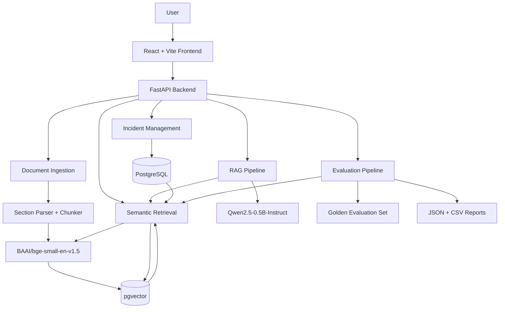
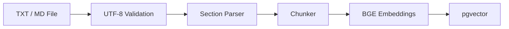
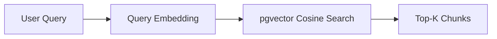
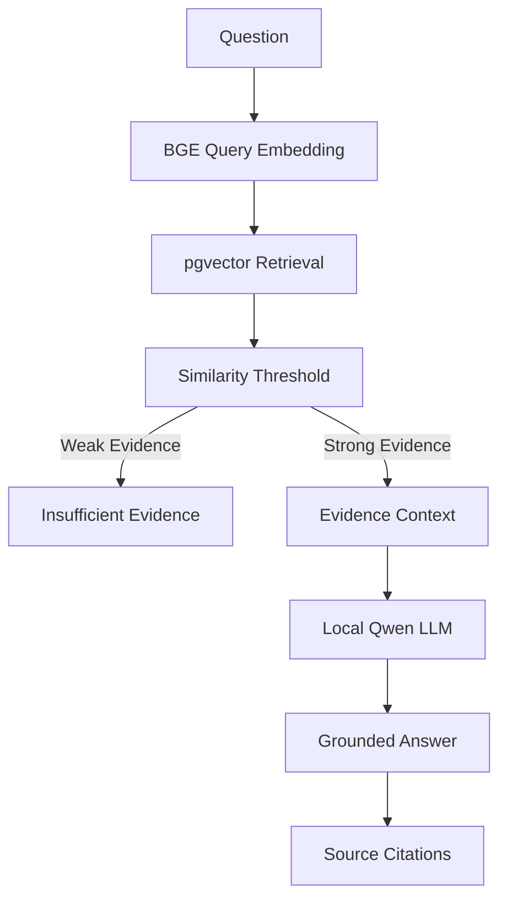

# Incident Memory Architecture

Incident Memory is a Retrieval-Augmented Generation (RAG) application for searching historical software incidents and operational runbooks.

The system combines structured incident management, document ingestion, semantic retrieval, local language-model generation, citations, and retrieval evaluation.

---

## High-Level Architecture



---

## Main Components

### Frontend

The user interface is implemented with React and Vite.

Main pages:

- Dashboard
- Incident management
- Document upload
- Similar incident search
- RAG assistant

The frontend communicates with FastAPI over HTTP.

---

## Backend

FastAPI provides the application API and coordinates the main system workflows.

Important backend responsibilities include:

- incident CRUD
- document ingestion
- section-aware chunking
- embedding generation
- vector retrieval
- incident ranking
- RAG context construction
- grounded answer generation
- citation metadata
- evaluation

---

## Database

PostgreSQL stores structured application data.

Core data includes:

- incidents
- documents
- document chunks
- incident metadata
- vector embeddings

The pgvector extension adds vector storage and cosine-similarity retrieval.

Each searchable chunk contains a 384-dimensional embedding.

---

## Embedding Model

Incident Memory uses:

`BAAI/bge-small-en-v1.5`

The model converts:

- incident sections
- runbook chunks
- user queries

into 384-dimensional semantic vectors.

These vectors are stored in PostgreSQL using pgvector.

---

## Incident Indexing

A structured historical incident is converted into searchable evidence sections.

Example:

```text
INC-012
│
├── summary
├── symptoms
├── root_cause
├── solution
└── notes
```

Each section is embedded independently.

This allows queries such as:

```text
What caused INC-012?
```

to retrieve the `root_cause` evidence rather than only retrieving the complete incident record.

---

## Document Ingestion Pipeline



The MVP supports:

- `.txt`
- `.md`

Uploaded documents are parsed into meaningful sections and chunks before embedding.

---

## Semantic Retrieval

A natural-language query is embedded using the same BGE model.



The retriever supports metadata filtering such as:

- service
- severity
- section
- incident date

---

## Similar Incident Search

Similar incident search retrieves relevant incident chunks and groups them by historical incident.

```text
Problem Description
        ↓
Query Embedding
        ↓
pgvector
        ↓
Matching Incident Chunks
        ↓
Group by Incident
        ↓
Rank Historical Incidents
```

The result includes:

- incident code
- title
- service
- severity
- symptoms
- root cause
- historical solution
- matching evidence
- similarity score

---

## RAG Pipeline

Incident Memory uses a local Hugging Face language model:

`Qwen/Qwen2.5-0.5B-Instruct`

The generation pipeline is:



Only retrieved evidence is supplied to the language model.

The model is instructed not to treat historical root causes as certain diagnoses of a current incident.

---

## Citation Design

The language model uses citation labels:

```text
[S1]
[S2]
[S3]
```

The backend maintains the authoritative mapping from a citation label to:

- chunk ID
- document ID
- incident code
- section
- service
- similarity score
- evidence text

This keeps citation metadata outside model control.

---

## Insufficient Evidence

If retrieved evidence does not pass the configured similarity threshold, the LLM is not used.

The API returns:

```text
There is not enough historical evidence to answer this question reliably.
```

This reduces unsupported generation.

---

## Local AI

Both major AI components run locally:

### Retrieval

`BAAI/bge-small-en-v1.5`

### Generation

`Qwen/Qwen2.5-0.5B-Instruct`

No paid OpenAI, Gemini, Claude, or other hosted LLM API is required.

---

## Evaluation

The evaluation module uses a Golden Test Set containing benchmark questions and expected sources.

For each question:

```text
Question
   ↓
Top-3 Retrieval
   ↓
Expected Source Present?
   ↓
PASS / FAIL
```

The principal metric is:

**Top-3 Retrieval Success**

Reports are written as JSON and CSV.

---

## Docker Architecture

Docker Compose manages:

```text
frontend
backend
db
```

Persistent Docker volumes are used for:

- PostgreSQL data
- Hugging Face model cache
- frontend node modules

The application ports are:

| Component       |                         Port |
| --------------- | ---------------------------: |
| React frontend  |                         5173 |
| FastAPI backend |                        18000 |
| PostgreSQL      | internal Docker network only |

---

## Design Scope

Incident Memory is intentionally an MVP-focused academic/portfolio project.

The architecture avoids unnecessary infrastructure such as:

- Kubernetes
- Redis
- Neo4j
- GraphRAG
- agent frameworks
- LangChain/LlamaIndex orchestration

The goal is to keep the complete RAG workflow understandable and reproducible.
